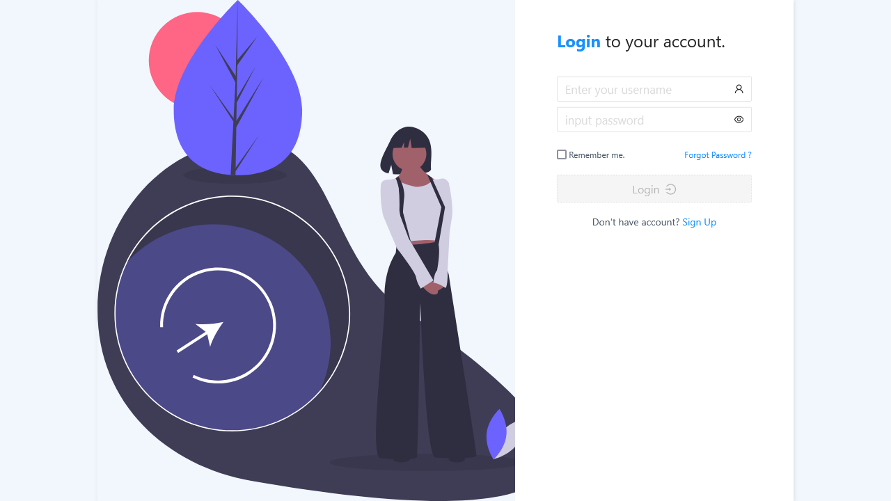
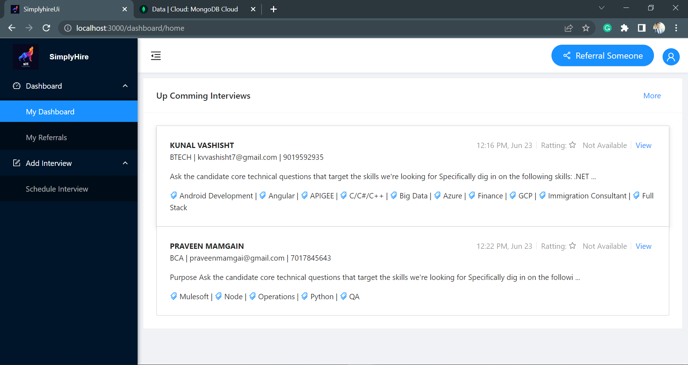
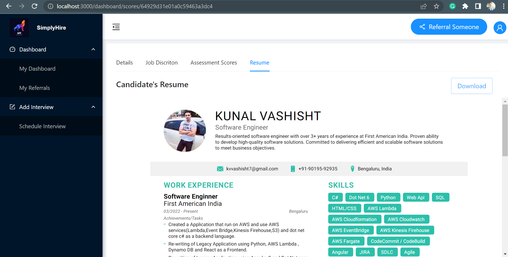
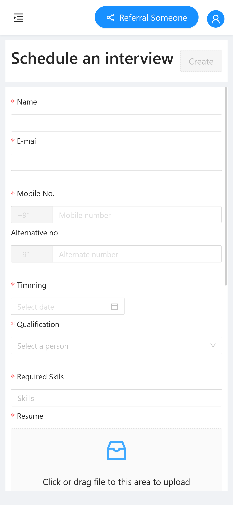

# SimplyHire
<hr/>

#### Simply Hire is an Hirring managment tool [devlopped froch strach in Angular, Nodejs, express, MongoDb]

<br/>

### ***Discription : I have created this application to streamline the interview evaluation process by providing a single interface to shedule the interview and manage the candidate information upload the resume and a lot more ...***

## Backend Folder [simplyhire-api]
We have used Nodejs Express MongoDb Mongoose for REST APIS for this project
API Documentation can be found here (it's a postmen workspace link)
[API Docs](https://api.postman.com/collections/20770503-cc3adf0a-cfa9-49b3-b876-f18fa95d2d34?access_key=PMAT-01H3EH01ACPE1RYDK3KHP0WKHG)

### How to spin up the backend server? 
<ol>
<li>  clone the project </li>
<li>  cd to simplyhire-api folder </li>
<li>  npm install</li>
<li>  npm run devstart </li>
</ol>


List of dependency for Backend devlopment

 ```
    "bcryptjs": "^2.4.3",
    "colors": "^1.4.0",
    "cors": "^2.8.5",
    "dotenv": "^16.0.3",
    "express": "^4.18.2",
    "joi": "^17.9.2",
    "jsonwebtoken": "^9.0.0",
    "mongoose": "^7.2.0",
    "nodemon": "^2.0.22"
```

<hr/>

## FrontEnd Folder [simplyhire-ui]
[Angular](https://angular.io/) and [Ant Design of Angular](https://ng.ant.design/docs/introduce/en) And [ng2-pdf-viewer](https://www.npmjs.com/package/ng2-pdf-viewer) used for this project

### How to spin up the backend server? 
<ul>
<li>  clone the project </li>
<li>  cd to simplyhire-ui folder </li>
<li>  npm install</li>
<li>  npm start </li>
</ul>

List of dependency for FrontEnd devlopment
```
    "ng-zorro-antd": "^14.0.0",
    "ng2-pdf-viewer": "^7.0.1",
    "rxjs": "~7.5.0",
```

<hr/>






